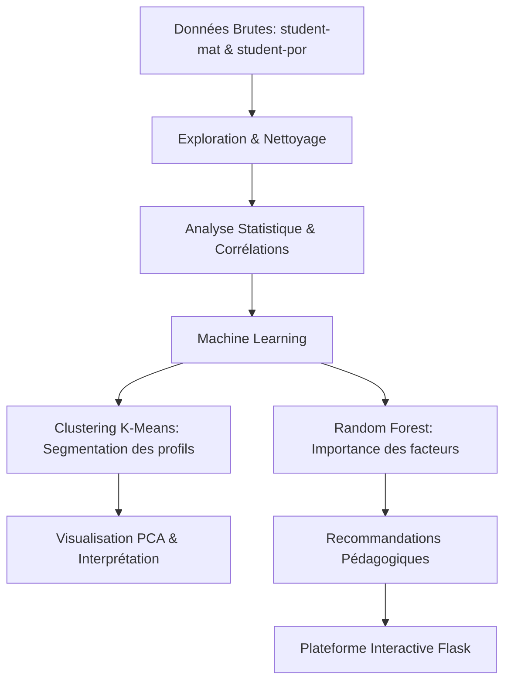
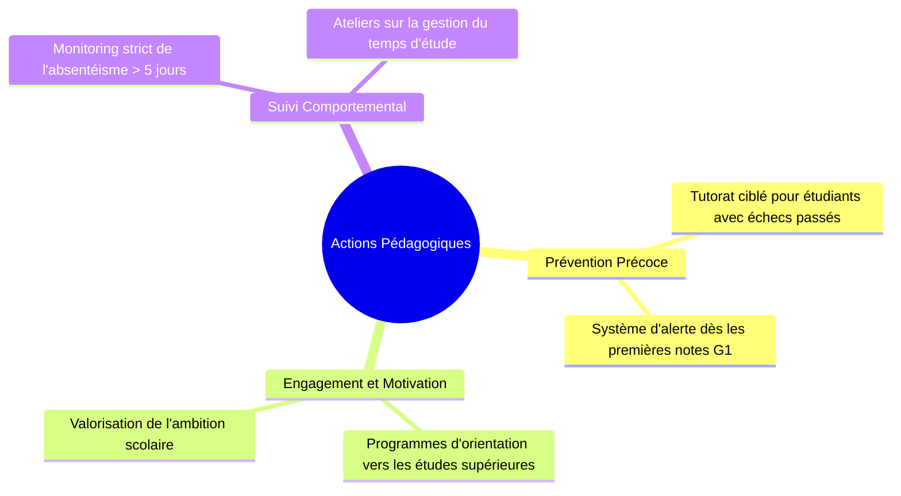

# Amélioration de la Réussite Étudiante — Sujet 3

Ce projet vise à identifier et analyser les facteurs influençant la performance académique des lycéens en **Mathématiques** et en **Portugais**. Il combine une analyse de données approfondie (Machine Learning) et une plateforme interactive pour aider les acteurs pédagogiques à prendre des décisions éclairées.

---

## Objectifs du Projet

L'analyse répond à trois problématiques majeures :
1.  **Comprendre les différents profils d'étudiants** via le clustering.
2.  **Identifier les facteurs déterminants de la réussite** (importance des variables).
3.  **Proposer des actions pédagogiques ciblées** pour réduire l'échec scolaire.

---

## Démarche Analytique

Le projet est structuré autour d'une pipeline de données rigoureuse :



---

## Résultats Clés

### 1. Profils d'Étudiants (Clustering)
L'algorithme **K-Means** (avec réduction de dimension **PCA**) a permis d'identifier 3 profils types stables entre les deux matières :
*   **Cluster 1 — Les Studieux :** Forte motivation, temps d'étude élevé, peu d'absences. Moyennes $G3 \approx 13-14/20$.
*   **Cluster 0 — Le Profil Moyen :** Habitudes de vie équilibrées, résultats corrects. Moyennes $G3 \approx 10-11/20$.
*   **Cluster 2 — Les Étudiants à Risque :** Nombre d'échecs passés élevé, absentéisme marqué, faible temps d'étude. Moyennes $G3 < 9/20$.

### 2. Facteurs d'Influence (Top 3)
Grâce au modèle **Random Forest**, nous avons quantifié l'impact de chaque variable :

| Rang | Mathématiques | Portugais |
| :--- | :--- | :--- |
| **1** | **Failures** (Échecs passés) | **Failures** (Échecs passés) |
| **2** | **Absences** | **Higher** (Ambition d'études sup.) |
| **3** | **Goout** (Sorties) | **Medu** (Éducation de la mère) |

> **Note :** La volonté de poursuivre des études supérieures (`higher`) est un levier de réussite beaucoup plus fort en Portugais qu'en Mathématiques.

---

## Recommandations Pédagogiques

Basé sur les résultats du Machine Learning, voici les actions prioritaires :



---

## Installation et Utilisation

### 1. Prérequis
Assurez-vous d'avoir Python 3.8+ installé.
```bash
pip install -r web-app/requirements.txt
```

### 2. Lancer la Plateforme Interactive
L'application Flask permet de tester différents modèles (LR, Random Forest, SVM) et de visualiser les importances de variables en temps réel.
```bash
cd web-app
bash run.sh
```
Puis ouvrez votre navigateur à l'adresse : [http://127.0.0.1:5000](http://127.0.0.1:5000)

### 3. Consulter l'Analyse Détaillée
Le notebook Jupyter contient l'intégralité du code de recherche, les graphiques avancés et les preuves mathématiques du clustering.
*   Fichier : `student-success-analysis.ipynb`

---

## Structure du Projet
*   `student-success-analysis.ipynb` : Analyse exploratoire, clustering et modélisation.
*   `web-app/` : Application Flask (Frontend & Backend).
*   `data/` : Jeux de données originaux (UCI Repository).

---
*Authored by Youssef Fellah.*
*Developed for the Engineering Cycle - Mundiapolis University.*
