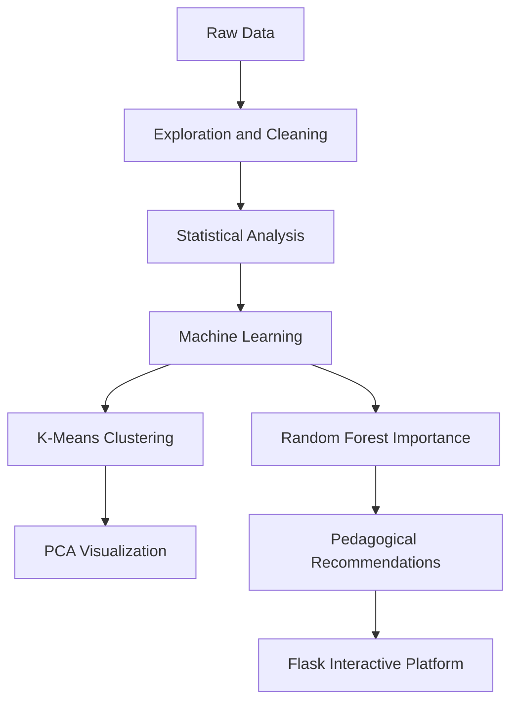

# Improving student success: academic performance analysis

This project identifies and analyzes the factors influencing the academic
performance of high school students in mathematics and Portuguese. It
combines machine learning analysis with an interactive platform to support
pedagogical decision-making.

## Project objectives

The analysis addresses three primary challenges:
1. Understanding student profiles through clustering.
2. Identifying the determining factors of academic success.
3. Proposing targeted pedagogical actions to reduce academic failure.

## Analytical approach

The project uses a structured data pipeline:



## Key results

### 1. Student profiles

The K-means algorithm identified three distinct student profiles:
- Studious: High motivation, high study time, and low absenteeism.
- Average: Balanced habits and consistent results.
- At-risk: High past failure rates, high absenteeism, and low study time.

### 2. Influential factors

Using a random forest model, the project quantified the impact of specific
variables. Past failures and absenteeism were identified as top predictors of
academic outcome in both subjects.

## Pedagogical recommendations

Prioritized actions include:
- Early prevention: Target students with past failures for specialized
  tutoring.
- Engagement: Implement programs to orient students toward higher education.
- Behavioral monitoring: Closely track absenteeism exceeding five days.

## Installation and usage

### 1. Prerequisites

Ensure Python 3.8 or later is installed.
```bash
pip install -r web-app/requirements.txt
```

### 2. Interactive platform

Run the Flask application to test models and visualize variable importance in
real-time:
```bash
cd web-app
bash run.sh
```

### 3. Detailed analysis

The Jupyter notebook contains the complete research code, advanced graphics,
and mathematical proofs for the clustering analysis.

## Project structure

- `student-success-analysis.ipynb`: The exploratory analysis and modeling
  notebook.
- `web-app/`: The Flask application directory.
- `data/`: The original datasets.

Authored by Youssef Fellah.
Developed for the Engineering Cycle at Mundiapolis University.
